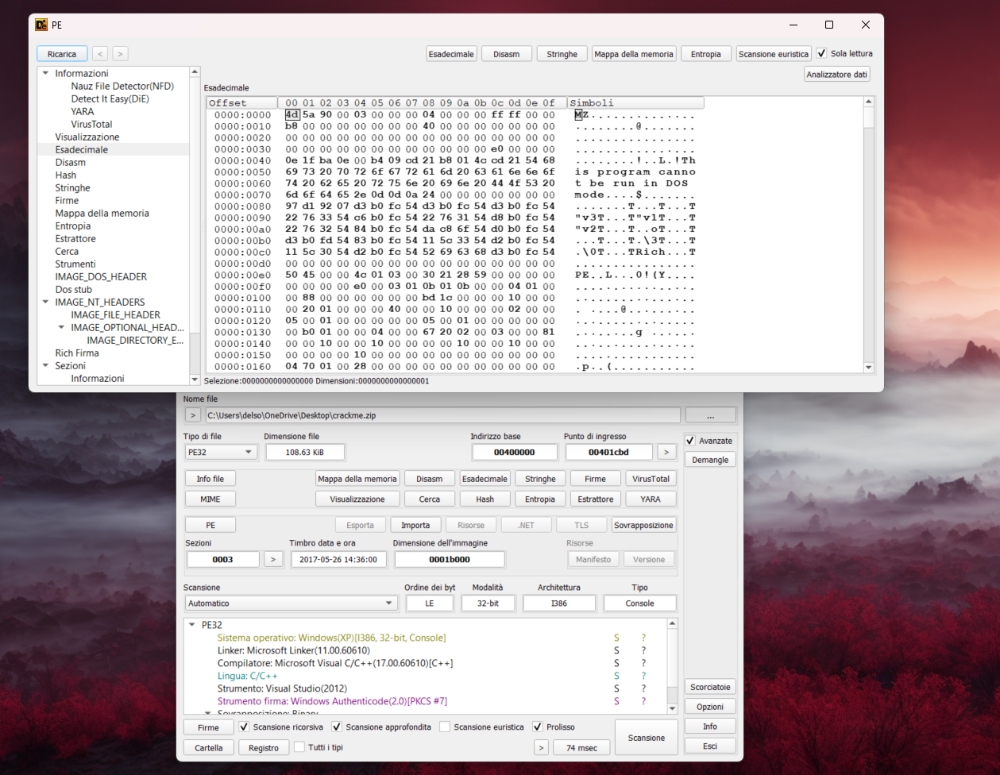
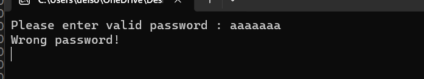

# [Eset Challenge Crackme (Part 1)](crackme0x00.exe)
#### Date: 18/feb/2023
Hi there,\
you can download this crackme from the official Eset website.

If you click on the download button, a zip file will be downloaded, but if you try to extract it an error will be returned.

At this point we look for more information, we open Detect It Easy and drag the file of interest.\
If we open the hex view, we can see that the first two bytes are MZ, so this should be a valid .exe file.

Let's change the file extension from .zip to .exe and try to run it.\
So we can see the file is now opened, it is a simple window that asks for a password, if we enter something random, the program ends.

Let's open the debugger to see what happens, the first thing we notice is that once we get to the entry point, if we try to continue the program ends, we don't manage to get to the moment in which it asks us for the password, there's probably some trick that detects the debugger.\
So let's start from the entry point and step line by line until we find some suspicious calls.
We can also look at the program imports and see that "IsDebuggerPresent" is there, we can put a breakpoint on all the calls of this function and if we run the program it will stop right on one of these, we can identify it much more quickly but nowadays no one uses this function to find a debugger, generally there are custom systems, so we will proceed with the first method which is more general even if slower.

Thus we arrive at the call at address 00401bf5, if we press F8 again (step over), the program will close so we have to find out what happens in this call.\
If we press F7(step into) we can immediately see the call to IsDebuggerPresent, let's check the body of the function:

mov eax,dword ptr fs:[30]                                                 
movzx eax,byte ptr ds:[eax+2]                                                                    
ret

We are in x86, so fs points to a data structure called TEB (Thread Environment Block), this structure contains information about the running thread. The first 12 members are pointers to void, and are reserved. It is therefore 12x4 = 48-bytes, in hexadecimal 30h.
At index 0x30 we find another data structure, called ProcessEnvironmentBlock, here after the first 2 reserved bytes, we find the position of our interest: BeingDebugged.
As its name indicates, it returns true if the process has "attached" a debugger.
Generally we find this result in EAX, indeed in the code a test is done:

test eax, eax\
jump if equal

Basically it executes the jump if the result of eax is zero, but we know that eax is not zero, so the jump will not executed and the ExitProcess will be called.

We therefore change the conditional jump with an unconditional one to bypass the control.

At this point the initial window that we had already seen will open asking us to enter a password, we can see a call to ReadConsole, the program expects an input.
Let's insert something random, we notice two things in the debugger:
1. A call is made to GetTickCount, so we expect another check to see the presence of debugger. This is typical timing function which is used to measure time needed to execute some function/instruction set. If the difference is more than fixed threshold, the process is attached to a debugger.
2. Several comparisons are made and if these are not respected a jump is taken,the first thing that comes to mind is that here the characters of the password are checked to see if it is correct.

Let's try to follow the normal flow of the program the first jne (jump if not equal ) at address 0040149A will obviously be executed and we arrive at the address 00401612, here we have an important part of the code that we must analyze carefully, we notice two things.
1. A value of 0 is put at the address ebp-1, subsequently this value (0) is put in the edx register, and we have already encountered the next two lines, as we said before jump if edx is 0, so this jump will be executed, but we immediately notice something suspicion, immediately after the jump there are three instructions that we skip because the jump takes us further down the program
mov eax,dword ptr fs:[30]                                                 
movzx eax,byte ptr ds:[eax+2]
test eax,eax
This is something similar to IsDebuggerPresent function, the function is not called directly, the check is done "manually".
This leads us to think that in order for that jump to go in the correct direction it must not be executed, otherwise why put a check for the debugger in a portion of code that is skipped?
2. Another suspicious thing we notice is a few lines above instead,in fact there is another jne that always takes us to the address 00401612,this seems to confirm that all those jne are used to compare the characters of the password we entered with the characters of the correct password,in particular in the image we see the last jne at address 40160A, and if this one also fails to execute(so we assume that all the password we entered was compared with the original passsword and the comparison returned true),at the address ebp-1 the value 1 is put,very suspicious as that,remembering that what caused us to execute the jmp before was instead the value 0 put in ebp.

In any case, to do the key test, we continue to follow the normal flow of the program,and we follow the je, if we step up to the WriteConsole we will be able to see this message printed.

Our suspicions were therefore well founded, that jump should not have been taken.
So let's take a few steps back, we know that that jump shouldn't be taken, for a display reason I put some nopes jump's point, same thing with the jump that checked the IsDebugged bit again, there are many cleaner methods to do it, but for now it's fine.
At this point we see another GetTickCount, a sub between two values ​​and a comparison, it is easy to understand that it is the control we were talking about before, in fact we notice a jbe (jump below or equal), the difference between the two values ​​that are there been returned by GetTickCoout is compared with 64 in hexadecimal, and if less, then the program continues executing the jump, otherwise it calls the ExitProcess.
Let's change the jbe to a jmp.
At address 401656 we see the push of two parameters on the stack, which probably carry out manipulations with the password we inserted, in fact in ecx we have the address of the first byte of the string we inserted, however we will go into more detail on this part later.
we step over, we immediately notice a compare and a jump, let's see in both cases, if we follow the normal flow of the program we notice that the cpm will be false and the jump will be executed, taking us to address 4016c9.

We can see a structure very similar to that of when "wrong password" was printed on the screen, but instead in this case there is printed a little help and the first congratulations, which we note down somewhere.

If we return to the previous jmp at address 401616 and try to force it, we will come across this new part of code, again with a similar structure which prints a strange output on the screen.

We need other information, so we open IDA and load the file, we can see the start from main where the anti-debug function is called, then the WriteConsole which tells us to enter a password, and after this we see some manipulations, we need to understand what happens here, we use the IDA disassembly to make the task easier.

Everything is immediately clearer to us, in fact after the ReadConsole we have operations on the characters of the string we have inserted, if each of these is verified then we move forward otherwise the program ends.
To be even more sure, let's use the IDA debugger, and let's see the variables.

We put a bp on the function and insert a random password and step forward, we can immediately see that the first letter is put in the buffer, the second in v9, the third in v10 and so on, we also notice that there is the number of characters read that is "A" or 10 in decimal, so the password must be 10 characters long.

We can rename all the variables in IDA for greater understanding

We remember the clue that the program had given us at the beginning and we put all the equations together
ch6+ch7=205
ch5+ch8=201
ch3+ch6+ch7=314
ch5+ch8+ch4+ch9=367
ch0+ch1=194
ch9+ch8+ch7+ch6+ch5+ch4+ch3+ch2+ch1+ch0=923

**Hint:**
ch8=85
ch0+ch2=128
ch4-ch7=-50
ch6+ch9=219

This is a simple system that we can solve online

We transform these values ​​into char and obtain:
ch0 = 80  → P
ch1 = 114 → r
ch2 = 48  → 0
ch3 = 109 → m
ch4 = 51  → 3
ch5 = 116 → t
ch6 = 104 → h
ch7 = 101 → e
ch8 = 85  → U
ch9 = 115 → s

At this point we go to test the password we found.

Let's see how we entered the part of the code where previously a strange output was shown, so probably a decryption operation was carried out, the output of the program tells us that the password is correct but the challenge is still not completed, in fact we have to look for a unreferenced text encrypted in the same way as this text.
If we look at IDA for convenience (but it is the same on x64dbg) we notice that after the jump which confirms that the password is correct, we have several operations.
20-bytes are passed to the procedure: the first push we see is the last parameter of the procedure, and is precisely the value 2, IDA tells us that in EDX there is the variable of the characters read therefore the value 0xA in EAX instead is the address of the first byte of the string deciphered before (Pr0m3theUs), the value 0x100 in decimal is 256 and in ECX instead there is address of a string (the ciphertext).

The subroutine at address 401350 is then called and if we read the pseudocode we see that the parameters match, there are operations inside.We must therefore find a string that can be decrypted with this function

As we said before we can see that in ECX the address of the string to be decrypted is passed, in fact if we go to the dump at this address we can see a series of characters which seem to make no sense, however if we execute the routine 401350, in the dump we find precisely the writing that is printed on the screen, we also note that a part of the string has not been decrypted,in particular the one starting from the address 4181A8.

At this point the idea is to re-execute the program and pass the address of this string to the function instead of the original one, we return to the point where the parameters are pushed, in particular in ecx we must put the new address, in at this moment the value is taken from the address 418034, we can directly modify this, you can see the red byte which was previously 80 and pointed to the old string now changed to 81, in x86 the addresses are in little endian, so if we look at the 4 byte we see A8 81 41 00 that become 00 41 81 A8,the address of the new string.

We have now reached the conclusion, in fact, we can see that in memory the new string also now makes sense, and a different message is printed on the console, a link that invites us to download part 2 of this challenge.\
Part 1 of the challenge is now complete.

