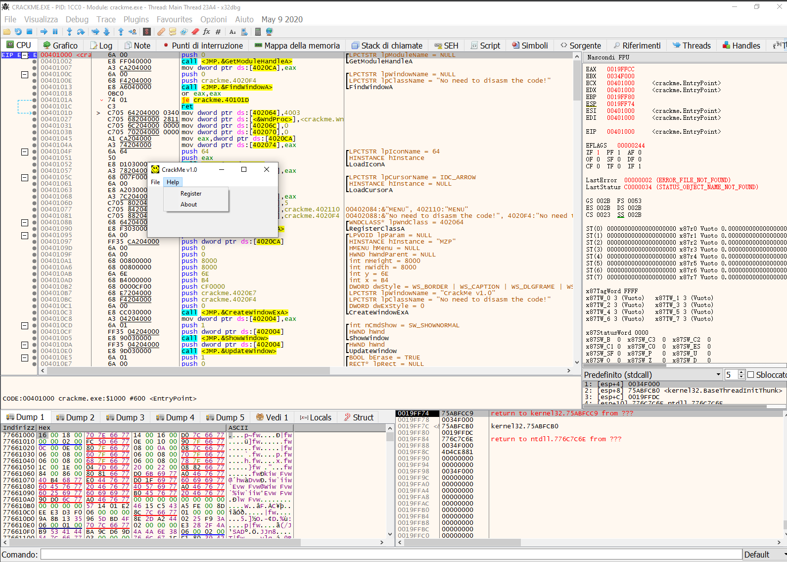
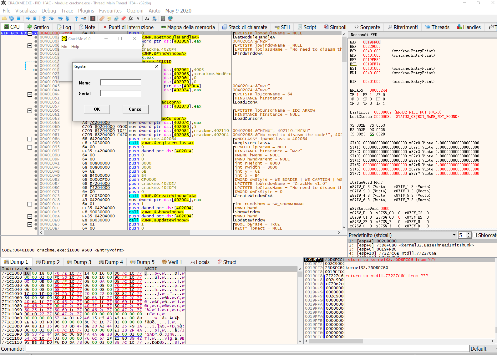
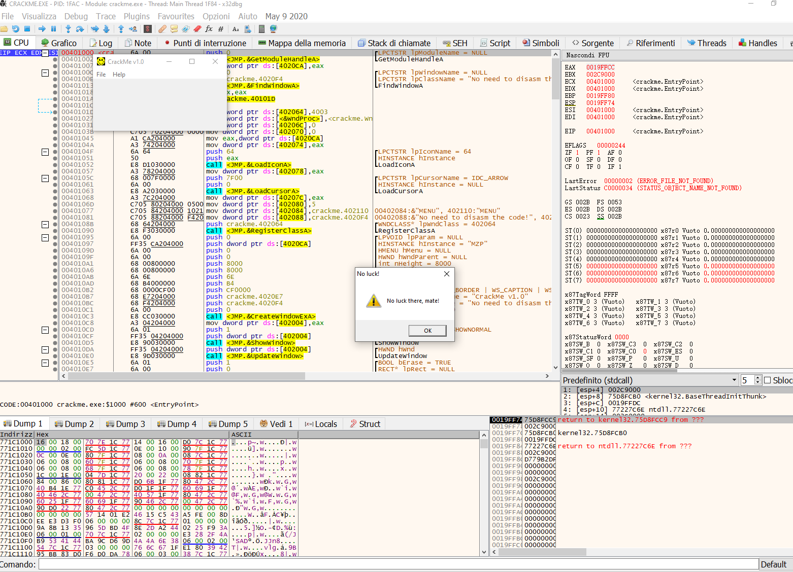
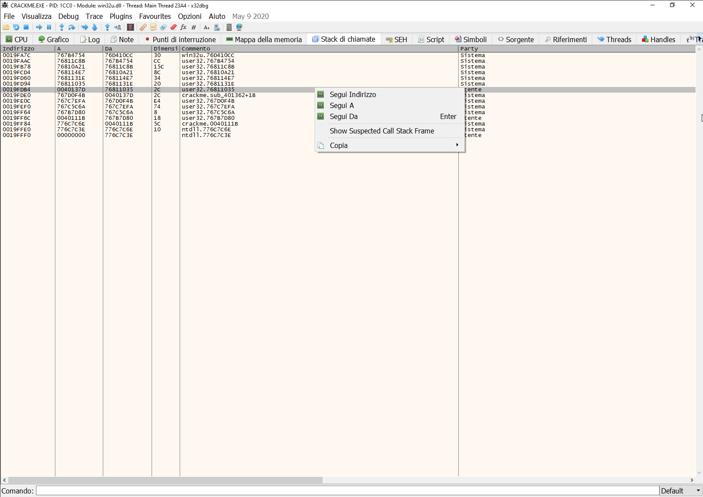
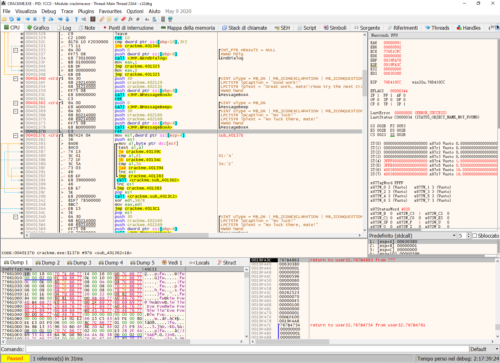
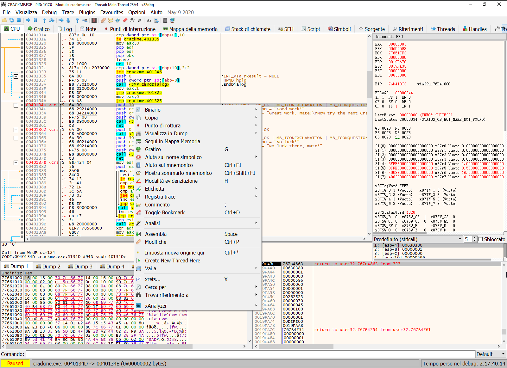
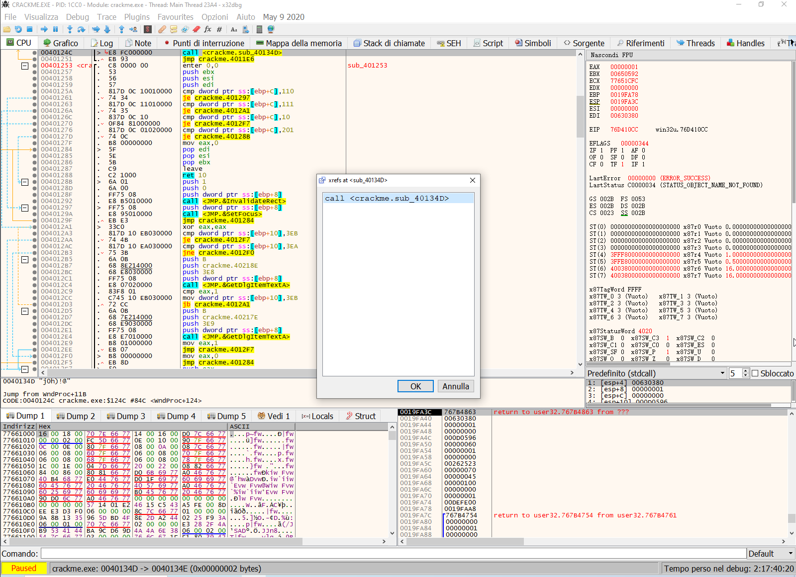
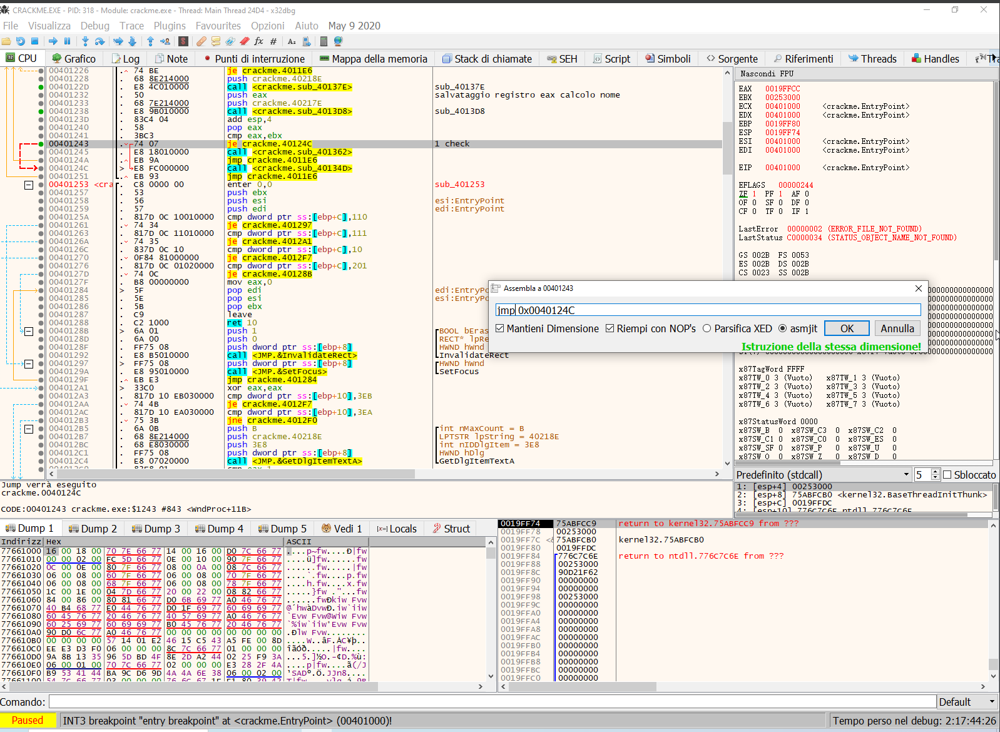
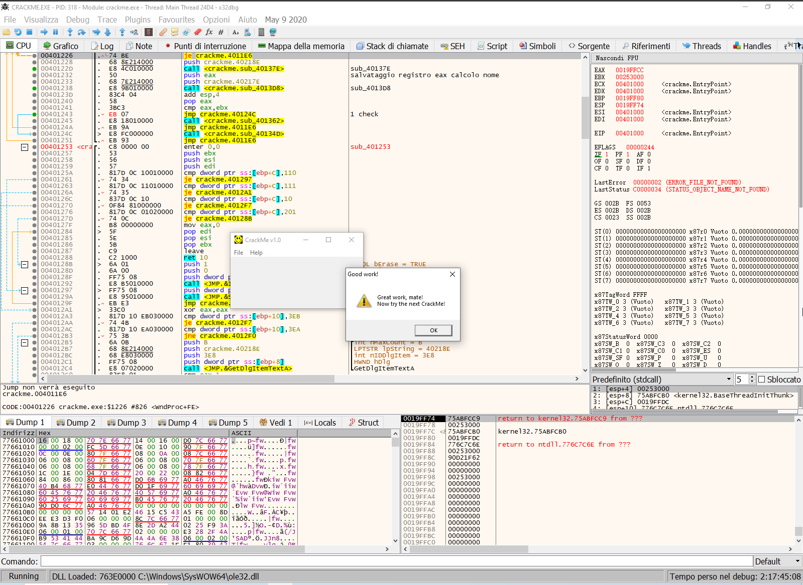

# [UIC crackme0x00](crackme0x00.exe)

#### Date: 23/nov/2023

## x64Dbg analysis

This first introductory crackme is very simple, trying to start it we see that we have few functions, in particular we can click on the "Help" button to make a submenu appear.

If we click on the "Register" button we notice the possibility of inserting a "name" and a "serial", this makes us understand that to activate the program we need both, let's try inserting something random and see the result.

We can see this error message, we also notice how in the Debugger the author of this crackme tells us not to patch the code, but I am too lazy to write a keygen and it is a task that I don't particularly enjoy.

Now let's try to insert something random to get the same error message, pause the x64dbg with the appropriate button and check the CallStack, this basically displays the call stack of the current thread.
We know that in the stack there must be the return address after showing the message on the screen, opening the CallStack screen we have several entries, in particular we look for addresses that do not lead to strange sections of code or outside of our base of code, since this crackme is simple we can almost immediately identify the right entry, which is the one highlighted in the figure, so let's follow the return address of our messagebox

we followed the address of the return, we check the module and we see that we are in the "crackme.exe", by scrolling we see the call to the MessageBox function with the message that appeared on the screen and just above another call to the MessageBox function, but with the text which says congratulations for completing the crackme, this is obviously the call that interests us.

let's go to the beginning of the function which is usually easily identifiable by a push (address 0040134D), right click and see who calls it

We have a call from this subroutine so let's follow it in the debugger

What we can see is that the routine (sub_40134D) i.e. our success message is called to the address 0040124C, let's try to understand how to get to this address, x64Dbg helps us a lot in this we can see the red line that shows us that to get to the address 0040124C, we must execute the "je" instruction (jump if equal) which basically after usually a cmp (compare) instruction sets what is called zero-flag (ZF) to 1 or 0 to decide whether to make the jump.
So what we can understand by reading these few lines of assembly:
cmp eax,ebx //will take care of checking the password we entered with the correct one generated by the program for our username, if you want to delve deeper into this part just follow the calls just above this address to calculate the serial number, take that as a good one what I'm saying.
At this point if the check was successful and this means that the serial you entered is equal to the one generated by the program, then the je (jump if equal) will be executed and we will arrive at the address 0040124C which takes care of show the success message.
What we can do is therefore modify the "je" instruction with the jmp instruction, i.e. it jumps unconditionally, at this point any serial number or password that we enter will be given to us as valid

As you can see from the image
# That's all folks!
