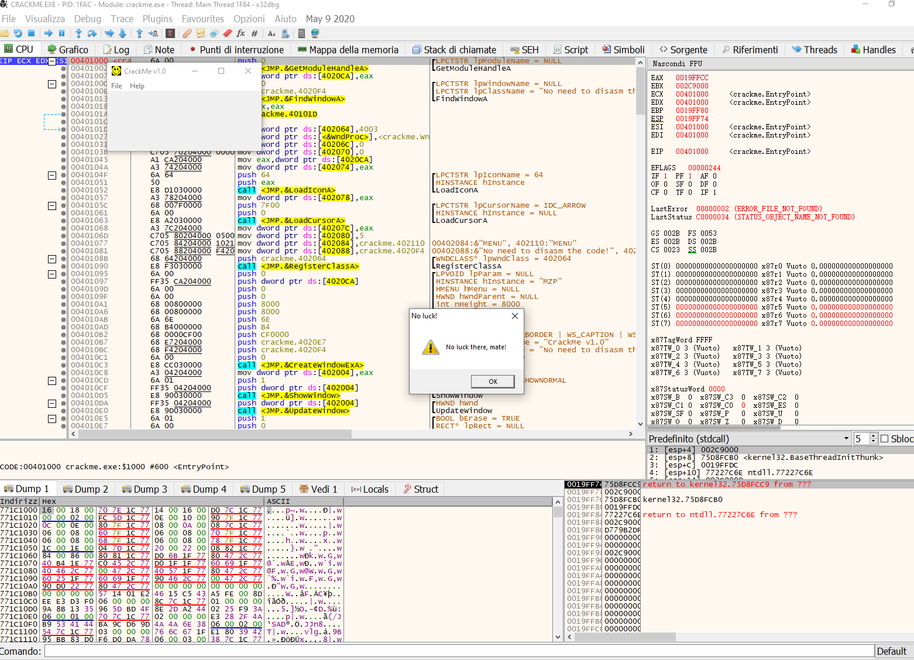

# [UIC crackme0x01](crackme0x01.exe)

#### Date: 23/nov/2023

## x64Dbg analysis
This second introductory crackme is simple, trying to start it we see that we have few functions, in particular we can click on the "Help" button to make a submenu appear.

If we click on the "Register" button we notice the possibility of inserting a "password", let's try inserting something random and see the result.

We can see an error message similar to the one seen in crackme 1

Let's now use one of the simplest methods to search for the register routine, it's important to know it but it doesn't work much on today's programs since the strings are almost always hidden or encrypted, but for simple crackmes it does its job.
We can see a series of strings in particular we can notice the string of the error message "No luck there,mate" and immediately above a string that seems like a success message "Great wokt,mate! etc etc", we follow this string, we find ourselves now in the function that shows the success message.
​

We look for "push 30" which identifies the start of the function and we check who calls this routine with the xrefs functionality.

The successful routine is therefore called at the address 0040124A, in which we clearly see the call to the sub routine. Scrolling slightly above, we can immediately notice a je (jump if equal), which makes us suspect a decision made on the basis of a check.
In fact, a cl,cl test is carried out.
TEST sets the zero flag, ZF, when the result of the AND operation is zero. If two operands are equal, their bitwise AND is zero when both are zero.
JE tests the zero flag and jumps if the flag is set,so basically the jump is taken if cl is zero.
We can see at the top right that the ECX register (also called counter register) has a value of 6, in particular cl(The least significant byte of register CX can also be used as a single 8-bit register called CL)
in our case cl is not 0 therefore the jump is not performed and we are shown the error message to proceed so we have understood that cl must be 0.

We can make a patch like "move cl,0" in this way that "je" will always be executed or we can modify the "je" with a "jmp" (jump).

In this way anything you enter in the "password" field will be considered valid and will lead to a success message.
If we wanted to investigate the the correct serial we can go to the routine located at address 4013B8 to understand how the serial is calculated, in this way we can not patch the program and leave it intact.

# That's all!
